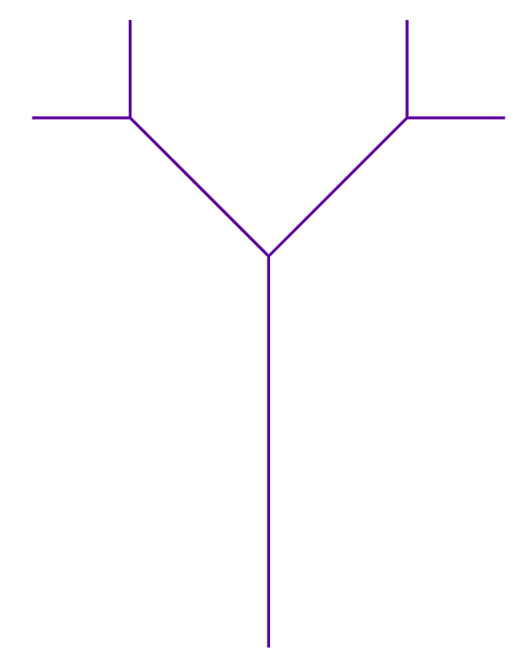

# 🐢 Fun with F# and turtle geometry

This workshop is based on content from the first two chapters of [Turtle Geometry: The Computer as a Medium for Exploring Mathematics](https://direct.mit.edu/books/oa-monograph/4663/Turtle-GeometryThe-Computer-as-a-Medium-for) by Harold Abelson and Andrea diSessa.

## 🚀 Getting started

Make sure you have .NET 10 SDK installed by running `dotnet --version` in the terminal. The .NET 10 SDK can be downloaded from https://dotnet.microsoft.com/en-us/download. 

1. Clone the repository
1. Run `dotnet restore` from the project root the first time
1. Run `dotnet watch run`. This will run the app and automatically rebuild the app when you make changes in the code
1. Navigate to <http://localhost:5000> in your browser
1. If you see a square you are good to go! 

### Editor

If you want good F# language support, and don't already have a preferred setup for working in .NET, I would recommend using [VS Code](https://code.visualstudio.com) with the [Ionide extension](https://github.com/ionide/ionide-vscode-fsharp).

### Alternative ways of running the code

There is setup for devcontainer, which can be used to work with the code on GitHub, using GitHub Codespaces, or locally from an IDE like VS Code. 

## 🐢 What is a turtle?

A turtle is a small animal moving around in a plane. The turtle doesn't move randomly, instead it responds to commands. 

The four simple commands we will be using are `Forward`, `Left`, `Right` and `Back`, and they all take an integer as input. For forward and back, the integer is the distance the turtle should move, for left and right, it is the degrees the turtle should rotate. The forward command will cause the turtle to leave a trace the distance it moved, while back does not. Forward and back change the turtles position, while left and right change the direction of the turtle.

In our program we will be most interested in the commands, and less interested in how the turtle executes them, the effect of the commands. We will work with lists of  `TurtleCommands` which each are a complete set of commands the turtle needs in order to create a specific path, and we will create various functions to make the list of desired commands more effectively.

## ♯ What is F#?

F# is a friendly, function-first language, running on the .NET platform. The team working with F# say that the F is for fun ([cited on Wikipedia](https://en.wikipedia.org/wiki/F_Sharp_(programming_language)#cite_note-41])), it really is for functional and [System F](https://en.wikipedia.org/wiki/System_F).

If you are new to F# you might want to take a look at [A very short intro to F#](/docs/fsharp-intro.md) to get a basic overview of the language and the syntax, and revisit it during the workshop. 

### F# interactive

F# interactive lets you play with the F# code directly in the console. You can start an interactive session with the command `dotnet fsi`. Then you can type F# expressions and execute them by typing `;;`.

If you are using VS Code you can select code in a `.fs` file and send the selection to F# interactive with the shortcut `Alt` + `Enter`.

The F# interactive can be useful when working with functions, to test that they behave as they should, without having to wait for code to rebuild.

## 🏗️ The workshop

The workshop consists of three parts:
* [🟥 Part 1: Polygons](#-part-1-polygons) - Make polygons and get familiar with lists and functions 
* Part 1B - A small detour with circles. The part can be skipped
* [🪾 Part 2: Growth and recursion](#-part-2-growth-and-recursion) - More recursion to make trees, snowflakes and Hilbert curves

If you have got the project running by following the steps in the [Getting started](#-getting-started) section, you are ready to start on [Part 1](#-part-1-polygons). You can read and follow the instructions at your own pace. We might also look at some topics together in the group. Don't hesitate to ask questions or share thoughts and ideas!

Some of the emojis are used to mark different types of content:
* ✍️ = A programming task to do, other tasks in the same part might depend on them
* 🎨 = Contains suggestions to explore something further, can be skipped
* 💡 = Describes a result, like a theorem
* 🧮 = A theoretical exercise, can be skipped

Spend time on the parts you find entertaining, whether it is to play with turtle designs or fiddle with F#. Follow your own ideas, and don't let the instructions limit you. The most important thing is to have fun! 🎉

## 🟥 Part 1: Polygons

### ✍️ Triangle

Our webpage is showing a square, so the natural first step is to make an [equilateral triangle](https://en.wikipedia.org/wiki/Equilateral_triangle). Look at the file `Core.fs`, and the value `square`, which contains a list of turtle commands. Take inspiration from `square`, and make a new value `triangle` containing a new list of commands, consisting of a combination of `Forward` and `Right`. Update `webPagePath` to point to `triangle`, and check how it looks in the browser.

### 🎨 Experiment

Experiment with the square, the triangle and the basic turtle commands. Combine them into something fun!

### ✍️ Repeat

Both `square` and `triangle` seem to repeat two commands, four and three times respectively. It might be nice to have a function `repeat` to do the repetitions for us, so let's make it. 

The function should take two arguments, an integer `count` for the number of repetitions,  and a list `commands`, the commands we want to repeat. The first part of the function declaration should look like `let repeat count commands =`, then followed by what should be the function body. Functions are let-expressions, just like for values, and the function arguments follows after the function name, without parenthesis around. (`(count, commands)` is a tuple in F#). 

The function body can be implemented in (at least) two ways. The easiest way is probably to use the functions `List.replicate` and `List.collect`, available from the [List module](https://fsharp.github.io/fsharp-core-docs/reference/fsharp-collections-listmodule.html). Replicate will make a list with the input repeated n times. The result of this will be of type list of list, since our initial input is a list of turtle commands. Collect will flatten the list, and make the elements of the inner list as separate elements of the result list. Collect needs a mapping function as argument, in our case it should be the identity function `id`.

Another way to implement `repeat` is by making a recursive helper function, that keeps track of the remaining repetitions and the accumulated result. The function should test if the counter is zero, then it should return the result, otherwise it should join the result with the input list, and then call itself with the counter decreased, and the accumulated result as the joined list. For this recursive function you will need to know that it must be declared with `let rec <function name>`, in order to be able to call itself, and that two lists can be joined with the `@` operator.

When repeat is finished, test that it works by rewriting square and triangle, and check that it looks as it should.

### ✍️ Poly

Now that we have `repeat` we can generalise `square` and `triangle`, and make a function `poly` that makes the turtle first move forward a given side distance, and then move right a given angle. This pattern repeats until the turtle closes the path it is drawing. We don't know yet when that happens, so for now we will just repeat the the two commands "forever", like 500 times. Make the function `poly` that takes two arguments `side` and `angle`. 

This function will make the turtle create some cool paths. Experiment with different angles: small, large, prime numbers etc. 

❓ When is a path complete so that the turtle walks the same pattern multiple times? When does a path not repeat itself within the limit of 500 repetitions? 

### 💡Poly closing theorem

> The path the turtle walks when given the commands produced by `poly` will be closed when the total turning is a multiple of 360

The total turning number is how much the turtle turns during a path, adding the degrees to the turning number when moving right, and subtracting the degrees when moving left. 

One of the proofs of the theorem sketched in the book is based on the property that all vertices of a path drawn by `poly` lie on a circle. This property can be proved by using that for three points, not on a line, there is a unique circle passing through them. Then one can use congruent triangles formed by the vertices to show that all the vertices has the same distance to the origin, and thus lie on the circle. With this established, we know that the turtle will walk along chords of equal lengths in this circle. But for any heading of the turtle, there is exactly one possible chord of the required length, so when the turtle reach its initial heading, which occurs when the total turning is a multiple of 360, it must also be at the initial position, and about to trace that first chord again.      

### ✍️ Polystop

Make an improved version of `poly`, the book calls it `polystop`, that uses the poly closing theorem, and stops repeating when the total turning is a multiple of 360. This function will need a recursive helper function, which keeps track of the total turning and the accumulated turtle commands, and returns the commands when the total turning is a multiple of 360. You might want to use the operator `%` that returns the remainder of dividing the first integer argument by the second.

Test how this new function works, but keep in mind that the web page might stop working if the paths get too long.

## 🪾 Part 2: Growth and recursion

Now that we have got the hang of recursion, let's do even more! 
It turns out that the turtle is good at fractal patterns. 

We will start with a regular binary tree. A tree consists of branches, where each branch has two child branches of half the length, at 45 degrees to the left and right from the top. 

### ✍️ Branch

Make the recursive function `branch` that creates the list of turtle commands for making a tree. The function should have `length` and `level` as arguments. 
If the level equals zero, the function should return an empty list, otherwise it should return a list consisting of moving forward the given `length`, then move 45 degrees left, call branch with `length/2` and `level - 1`, then move right 90 degrees (which will be 45 degrees right of the parent branch), and call branch with `length/2` and `level - 1`.  

Think about how this function should work. If level equals 1 the turtle should just draw a vertical line, if the level is 2, the path is the vertical line, with two branches on the top, of half the length, in 45 degrees left and right from main branch. The tricky part is that the state of the turtle has to be restored so that the turtle returns back to where it began after each branch. The book calls this property *state-transparency*. To get back to where the turtle started, we have to rotate it a bit left, and use `Back` to send it to where it started.

See how the trees produced by `branch` look for different values of level.

### 🎨 Experiments

Since the turtle will have returned to the start of the tree when it is finished, it is fun to combine multiple trees in the same path. Experiment with making a chain of trees by rotating some degrees in the same direction between each tree, or make them into an avenue. 

If you want to make more realistic looking trees you can experiment with the angle between the sibling branches, and the length of each branch. It might for instance vary depending on whether it is a left branch or a right branch. 

### 🧮 Math

What is the total length of the lines drawn by the turtle? 

